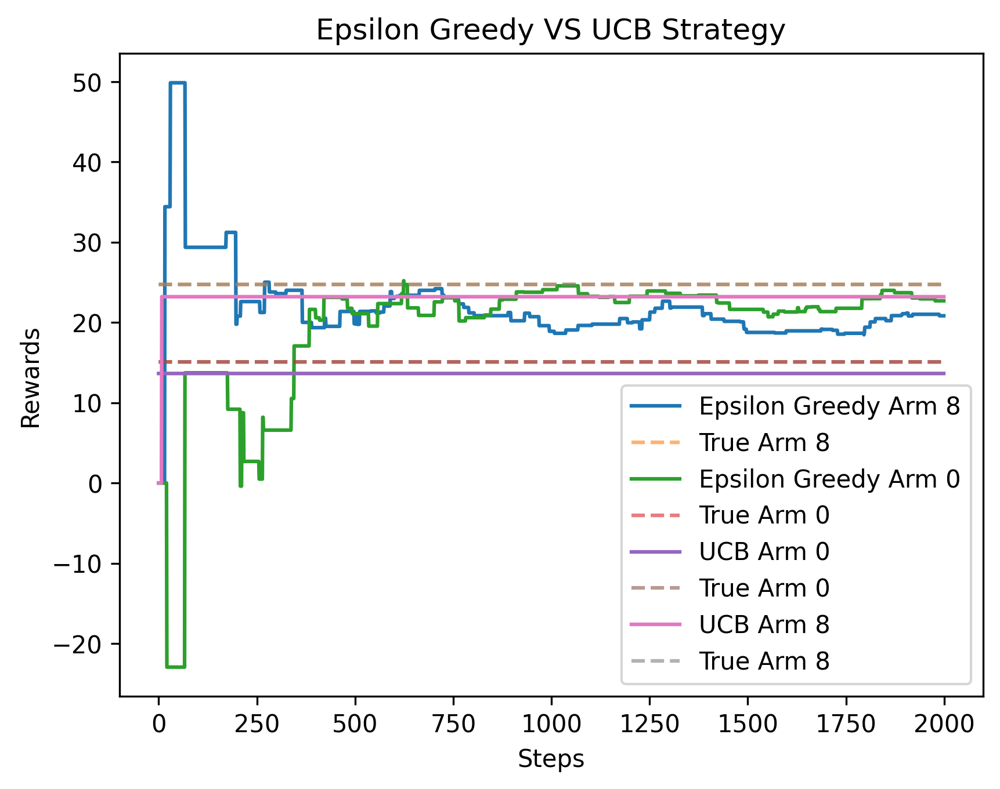

# k Arm Bandit Emulator

## Features

-Build non-stationary enviroment 
-Build your agent 
-Select epochs and stratergy 
-Vizualize growth over steps 
-Compare different stratergies 
-Save Plots 
-Save Logs 
-Save data directly into csv 

## TO Run

in the file : main.py
-specify enviroment config and agent config 
-select which graph to view 
-log the data generated 
-run the file :) 

## Quick tips

#### Refer to examples

-Initialize Enviroment
-Initialize Agent
-Run experiment
-Plot Graph
-Retrieve Data

-Example for comparison between two Strategy

